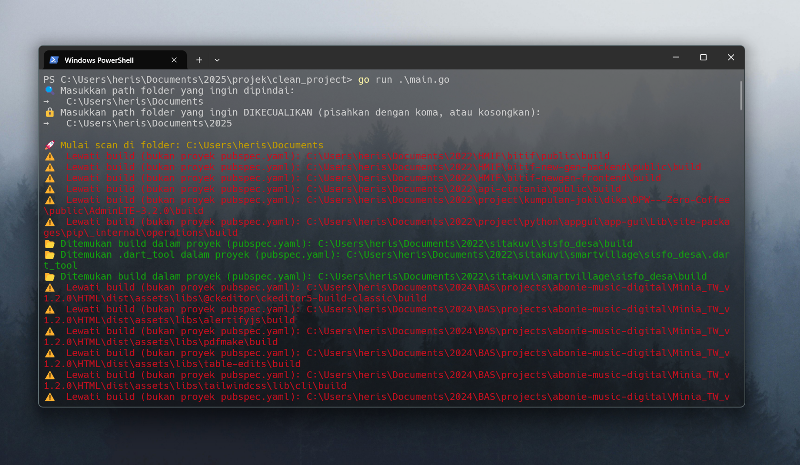
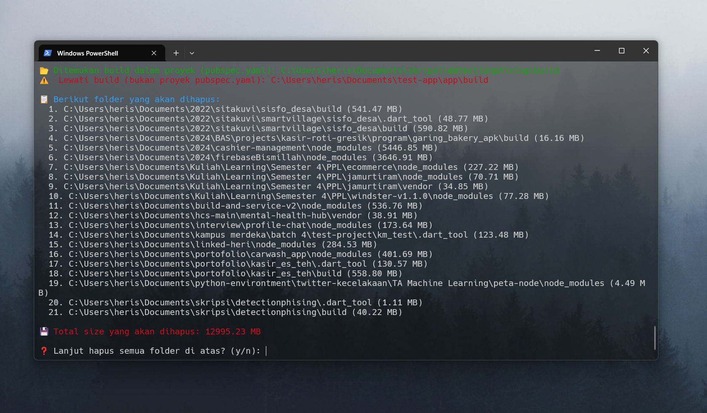
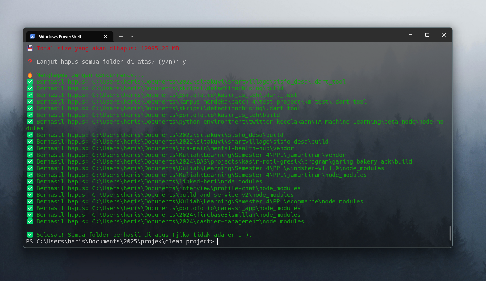

# 🧹 TrashAway - Project Cleaner 

**TrashAway** adalah CLI tool ringan berbasis Go untuk membersihkan folder sampah seperti `node_modules`, `vendor`, `build`, dan lainnya dari berbagai proyek seperti Flutter, Laravel, Next.js, dan Node.js.

## 📸 Demo Penggunaan

### ✅ 1. Masukkan folder utama yang ingin discan



---

### 🚫 2. Konfirmasi sebelum penghapusan + lihat total size yang akan dibersihkan



---

### 🔥 3. Yess folder berhasil di hapus



---

## ✨ Fitur Unggulan

- 🔍 **Deteksi otomatis** proyek berdasarkan file marker seperti `package.json`, `pubspec.yaml`, `composer.json`
- 🧼 Hapus folder:
  - `node_modules` (Node.js, Next.js, React, dll)
  - `vendor` (Laravel / PHP)
  - `build`, `.dart_tool` (Flutter)
- ⚡ **Multi-threaded** pakai Goroutines — lebih cepat!
- 📂 Input folder yang ingin di-scan dan folder yang ingin **dikecualikan**
- 📏 Hitung total ukuran yang akan dihapus (sebelum hapus)
- 🎨 Tampilan warna-warni di CLI
- ✅ Konfirmasi sebelum proses penghapusan

---

## 🚀 Cara Menggunakan

### 🔧 1. Build Program

```bash
go build -o project-cleaner
```

Lalu ikuti langkah-langkah interaktif di terminal:

- Masukkan path folder utama (misal: C:\Users\heris\Documents)
- Masukkan folder yang ingin dikecualikan (misal: C:\Users\heris\Documents\2025)
- Program akan scan semua sub-folder, mendeteksi folder seperti node_modules/vendor, lalu menampilkan daftar hasil + ukuran total
- Confirm sebelum dihapus


## ⚠️ Perhatian
Program tidak akan menghapus folder sembarangan.

Setiap folder target dicek apakah benar bagian dari proyek tertentu (misal, node_modules hanya akan dihapus jika ada package.json)

Tetap hati-hati ya bro, walaupun udah ada konfirmasi, namanya hapus-hapusan 😅


## 📂 Struktur Folder Target
| Folder         | Akan dihapus jika ada file... |
| -------------- | ----------------------------- |
| `node_modules` | `package.json`                |
| `vendor`       | `composer.json`               |
| `build`        | `pubspec.yaml`                |
| `.dart_tool`   | `pubspec.yaml`                |


## 💡 Rencana Fitur Tambahan
 - Mode --dry-run (lihat dulu tanpa hapus)
 - Export log hasil scan/hapus ke file .txt
 - Dukungan konfigurasi .cleanerrc
 - Mode GUI (web atau TUI CLI)


### 👨‍💻 Dibuat oleh [Heri Setyawan](https://github.com/Herisetyawan123) 💻
Buat bantu bersih-bersih project dengan tenang tanpa harus klik satu-satu 🙌